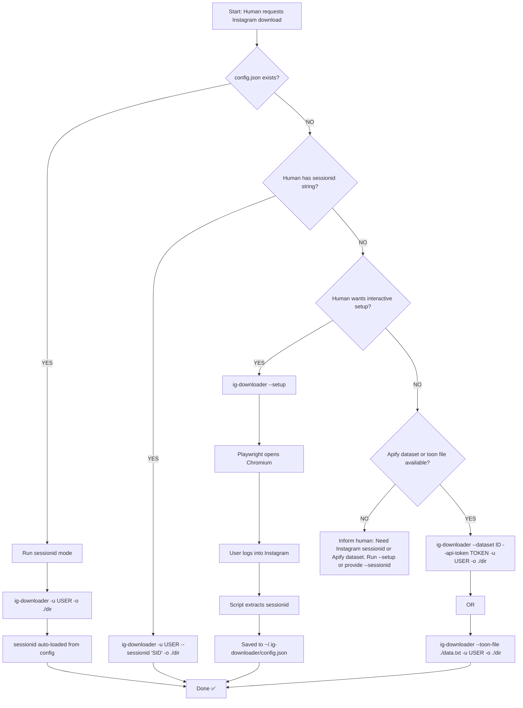

# ig-downloader — Agent Instructions

> Instrucciones para que un subagente OpenCoder invoque `instagram_downloader.py`
> correctamente, seleccionando el modo óptimo según el contexto disponible.

---

## 1. Identity

| Field | Value |
|-------|-------|
| **Tool name** | `ig-downloader` |
| **Script path** | `instagram_downloader.py` (same directory as this file) |
| **Version** | 2.4.0 |
| **Language** | Python 3.7+ |
| **Dependencies** | `instagrapi`, `requests`, `playwright` |

---

## 2. Trigger Conditions

Activate this agent when the human says ANY of:

| Español | English |
|---------|---------|
| "descargar instagram de [user]" | "download instagram [user]" |
| "bajar reels / posts / carruseles de [user]" | "download reels / media of [user]" |
| "scrapear perfil de instagram [user]" | "scrape instagram profile [user]" |
| "extraer fotos/videos de [user]" | "extract photos/videos from [user]" |
| "quiero guardar el perfil de [user]" | "save instagram profile [user]" |
| "configurar / setup instagram" | "setup / configure instagram download" |

---

## 3. Mode Selection Logic (Priority Order)

The script auto-detects the best auth method. This is the decision tree the agent
should follow before invoking the script:



**Rule**: Never recommend `--login` mode — it is BROKEN (Meta deprecated
the underlying endpoint server-side). All login attempts with
`Client.login()` return 404.

---

## 4. Mode Details

### Mode A: Sessionid (from config) 🥇

**When**: `~/.ig-downloader/config.json` exists with a valid sessionid.

**Command**:
```bash
python instagram_downloader.py -u <username> -o <output_dir>
```

**Behavior**:
- Fetches ALL posts via `instagrapi.login_by_sessionid()` + `user_medias()`
- All carousel images extracted via `media_info()`
- No date cutoff. No post type filter (downloads everything).
- Downloads via `photo_download()` / `video_download()` (instagrapi native auth)

**Output structure**:
```
<output_dir>/
└── YYYY-MM-DD/
    └── <SHORTCODE>/
        ├── <SHORTCODE>.mp4        (reels)
        ├── <SHORTCODE>.jpg        (photos, carousel img 1)
        ├── <SHORTCODE>_02.jpg     (carousel img 2/N)
        ├── ...
        └── post_info.txt
```

**If sessionid expired**: Script shows "Login required" error. Re-run `--setup`.

---

### Mode B: Sessionid (direct flag)

**When**: Human provides a sessionid cookie string.

**Command**:
```bash
python instagram_downloader.py -u <username> --sessionid "<SID>" -o <output_dir>
```

Same behavior as Mode A.

---

### Mode C: Setup (Playwright) 🥇 for first-time

**When**: No config exists and human wants a guided setup.

**Command**:
```bash
python instagram_downloader.py --setup
```

**Behavior**:
1. Checks if Playwright is installed. If not, prompts human to install.
2. Launches clean Chromium browser (no Chrome profile needed).
3. Navigates to `https://www.instagram.com`.
4. Human logs in manually (or is already logged in).
5. Script polls `context.cookies()` for `sessionid` every 3 seconds.
6. On detection: saves to `~/.ig-downloader/config.json`, closes browser.
7. If Playwright unavailable → falls back to Chrome cookie extraction.
8. If Chrome extraction fails → prompts human to paste sessionid manually.

**After setup**: Mode A works without any flags.

**Requirements**:
```bash
pip install playwright
playwright install chromium
```

---

### Mode D: Apify (legacy fallback)

**When**: Human has an Apify dataset export (no Instagram cookie).

**Command**:
```bash
# From MCP output file
python instagram_downloader.py --toon-file ./data.txt -u <username> \
    --date-start YYYY-MM-DD --date-end YYYY-MM-DD \
    --type reel --own-only \
    -o <output_dir>

# Or from Apify API directly
python instagram_downloader.py --dataset <DATASET_ID> \
    --api-token apify_api_xxx -u <username> -o <output_dir>
```

**Limitations**:
- Carousels >4 weeks old: only first image (thumbnail_url)
- Carousels <4 weeks old: all images via GQL enhancement
- CDN URLs may expire after hours
- Requires Apify account + Actor run

---

## 5. Flag Reference

| Flag | Mode | Description |
|------|------|-------------|
| `-u / --username HANDLE` | All | Target Instagram handle (required) |
| `-o / --output DIR` | All | Output directory |
| `--sessionid STR` | B | sessionid cookie (direct, overrides config/env) |
| `--setup` | C | Interactive setup: Playwright → Chrome → manual paste |
| `--dataset ID` | D | Apify dataset ID |
| `--api-token KEY` | D | Apify API token |
| `--toon-file PATH` | D | Apify dataset as JSON/YAML file |
| `--date-start YYYY-MM-DD` | D | Date filter (inclusive start) |
| `--date-end YYYY-MM-DD` | D | Date filter (inclusive end) |
| `--type {reel,carousel,photo,all}` | D | Post type filter |
| `--own-only` | D | Only posts by `--username` |
| `--mentions-only` | D | Only posts mentioning `--username` |
| `--flat` | D | Flatten output (no date/shortcode folders) |
| `--no-instagrapi` | D | Skip GQL carousel enhancement |
| `--no-verify` | D | Skip SSL verification |
| `--version` | Any | Show version and exit |
| `--help` | Any | Show help message |

> ⚠ **Not listed**: `--login`, `--password`, `--totp`. These flags exist but
> **do not work**. Meta deprecated the underlying login endpoint (`/v1/bloks/...`).
> The agent must NOT recommend these. Use `--setup` instead.

---

## 6. Dependencies

The agent should ensure these are installed before invoking:

```bash
# Core
pip install instagrapi requests

# Optional (for --setup browser automation)
pip install playwright
playwright install chromium
```

If Playwright not installed and `--setup` is used, the script gracefully falls
back to Chrome cookie extraction → manual paste prompt.

---

## 7. Known Issues & Guardrails

| Issue | Agent Action |
|-------|-------------|
| Login broken (Meta) | NEVER recommend `--login`. Always use `--sessionid` or `--setup`. |
| Sessionid expires | If script prints "Login required" → tell human to run `--setup` again. |
| Carousels limited in Apify mode | If human needs full carousels → recommend sessionid setup. |
| Apify URLs expire | If downloads fail with 403 → tell human to re-run Apify Actor. |
| Playwright not installed | Falls through to Chrome → manual paste. Agent can offer to install. |

---

## 8. Example Agent Interactions

### Human: "Download all Instagram posts from username"

```
Agent:
1. Check if ~/.ig-downloader/config.json exists.
   - If YES → run sessionid mode:
     python instagram_downloader.py -u username -o ./instagram_username
   - If NO → offer setup:
     "I need Instagram access. Run --setup once to save your session, or
      provide a sessionid cookie."
```

### Human: "I want to download just the reels from this dataset"

```
Agent:
   python instagram_downloader.py --toon-file ./data.txt \
       -u username --type reel -o ./reels_only
```

### Human: "Setup Instagram download"

```
Agent:
   python instagram_downloader.py --setup
   Explain: "A browser will open. Log in to Instagram, then the script
   will detect your session automatically."
```

---

## 9. Quick Reference

```bash
# --- Sessionid mode (existing config) ---
python instagram_downloader.py -u username -o ./downloads

# --- Setup (first time) ---
python instagram_downloader.py --setup

# --- Sessionid mode (direct cookie) ---
python instagram_downloader.py -u username --sessionid "1234..." -o ./downloads

# --- Apify mode (toon file) ---
python instagram_downloader.py --toon-file ./data.txt -u username -o ./downloads

# --- Apify mode (API) ---
python instagram_downloader.py --dataset <ID> --api-token xxx -u username -o ./downloads
```

---

*ig-downloader AGENTS.md v2.4.0 — Last updated: 2026-07-07*
