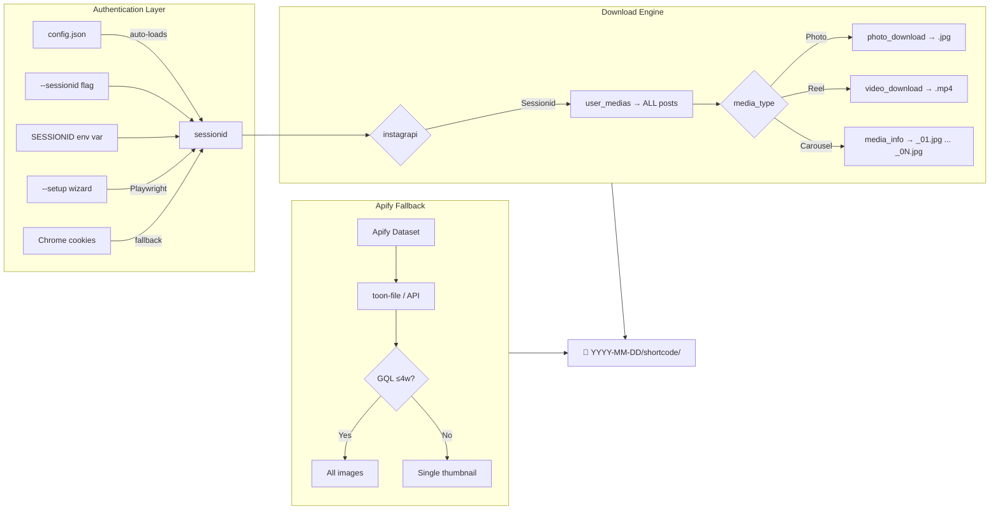
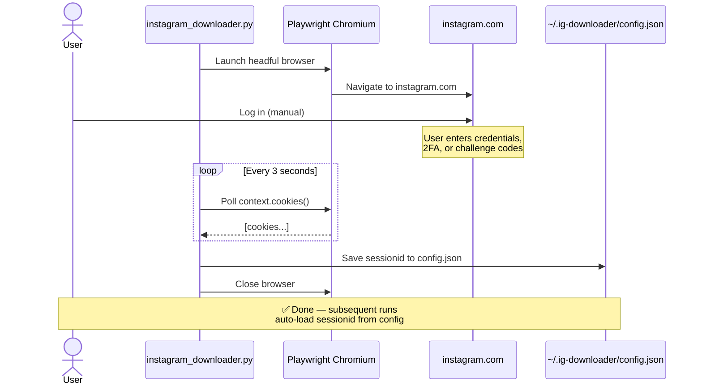

# Instagram Downloader Skill v2.2

> Download Instagram media — reels, carousels (all images), photos — via **sessionid (instagrapi, recommended)**, **Playwright setup wizard**, or **Apify dataset** fallback. No password sharing required.

> **⚠ 2026-07-07: `--login` mode is BROKEN.** Meta deprecated the instagrapi login endpoint server-side. Use `--setup` (Playwright) or a manual `--sessionid` cookie instead.

[](LICENSE)
[](https://www.python.org/downloads/)
[](https://github.com/subzeroid/instagrapi)

---

## 🚀 One-Click Install

Choose your platform and run:

| Platform | Command |
|----------|---------|
| **Linux / macOS / Git Bash** | `curl -fsSL https://raw.githubusercontent.com/cripterhack/ig-downloader-skill/main/install.sh \| bash` |
| **Windows PowerShell** | `iex (iwr -Uri https://raw.githubusercontent.com/cripterhack/ig-downloader-skill/main/install.ps1).Content` |
| **From cloned repo** | `git clone https://github.com/cripterhack/ig-downloader-skill.git && cd ig-downloader-skill && ./install.sh` |
| **npx (Skills.sh)** | `npx skills add cripterhack/ig-downloader-skill` |

Each installer will:
1. ✅ Install the Python package (`ig-downloader` CLI via `pip`)
2. ✅ Detect your AI agent (OpenCode, Claude Code, Codex CLI, Cursor)
3. ✅ Copy the skill files (`SKILL.md` + `AGENTS.md`) to your agent's skills directory
4. ✅ Verify everything works

> **Zero configuration.** No need to manually copy SKILL.md files or install dependencies one-by-one.

---

## Table of Contents

- [Why This Tool Exists](#why-this-tool-exists)
- [Quick Start](#quick-start)
- [Operation Modes](#operation-modes)
- [Getting the Sessionid Cookie](#getting-the-sessionid-cookie)
- [Installation](#installation)
- [Usage Guide](#usage-guide)
- [Examples](#examples)
- [Output Structure](#output-structure)
- [Troubleshooting](#troubleshooting)
- [FAQ](#faq)
- [Contributing](#contributing)
- [License](#license)

---

## Why This Tool Exists

Traditional Instagram downloaders (`instaloader`, `gallery-dl`) fail with 403/NotFound errors because Instagram aggressively blocks scraping. The web page no longer embeds JSON data (`__INITIAL_STATE__` removed). Solutions exist but each has tradeoffs:

| Approach | Issue |
|----------|-------|
| `instaloader` | 403 on all GraphQL queries |
| `gallery-dl` | 403 on direct URLs |
| Apify Actors | ❌ Carousels: only 1st image. Old posts: GQL fails. Cost: ~$0.03/run. |
| `instagrapi` GQL (no login) | ✅ Free, but only recent posts (<4 weeks) |

**v2.2 solution**: Two working authentication paths + one fallback:
1. **Sessionid** (recommended) 🥇: Cookie-only access via `instagrapi` (no password, no 2FA). Full access to ALL posts, ALL carousel images, ANY date.
2. **Apify** (fallback): Dataset-based when no sessionid is available.
3. **`--setup`**: Playwright browser auto-extracts sessionid and saves to config.

> **`--login` mode removed**: Meta deprecated the underlying endpoint. Login via password no longer works.

---

## How It Works



---

## Quick Start

### 0. Install the skill (one-time)

```bash
# Option A — Universal installer (recommended)
curl -fsSL https://raw.githubusercontent.com/cripterhack/ig-downloader-skill/main/install.sh | bash

# Option B — From source
git clone https://github.com/cripterhack/ig-downloader-skill.git
cd ig-downloader-skill
./install.sh
```

The installer auto-detects your AI agent (OpenCode, Claude Code, etc.), copies
the skill files, and installs the `ig-downloader` CLI globally.

### 1. Set up Instagram access

```bash
ig-downloader --setup
```

A browser opens. Log into Instagram. The `sessionid` cookie is saved automatically.

> **No password sharing.** The `--setup` wizard uses Playwright to capture a cookie only.

### 2. Download a profile

```bash
ig-downloader -u username -o ./my_downloads
```

No `--sessionid` flag needed after setup — the CLI reads your saved config.

---

## Operation Modes

| Mode | How | Best For |
|------|-----|----------|
| **Sessionid** 🥇 | `instagrapi` login via browser cookie | Full access. All posts, all carousels, no date limit. No password sharing. |
| **Apify (legacy)** | `unseenuser/IG-posts` dataset | No login at all. Carousels limited to 1 image for posts >4 weeks. |
| **Setup** | Playwright browser → captures cookie → saves config | One-time. Enables sessionid mode. |

### Mode Comparison

| Feature | Sessionid | Apify |
|---------|-----------|-------|
| Authentication | Cookie `sessionid` | None |
| All posts (any date) | ✅ | ✅ (catalog) |
| Carousels: ALL images | ✅ (via `media_info()`) | ❌ 1st image only (old posts) |
| Carousels: recent posts | ✅ | ✅ (GQL enhancement) |
| Private profiles | ✅ (if you follow) | ❌ |
| Session persistence | ✅ `config.json` | N/A |
| Download method | `instagrapi` native | `requests` + `instagrapi` GQL |
| Cost | $0 | ~$0.03/run |
| Setup time | 1 min (first time via --setup) | 5 min (Apify account) |

---

## Authentication

### A. Interactive Setup (recommended)

```bash
pip install playwright && playwright install chromium
python instagram_downloader.py --setup
```



1. Launches a clean Chromium browser (no Chrome profile needed)
2. You log into Instagram normally
3. Script detects the `sessionid` cookie automatically via Playwright's `context.cookies()`
4. Saves to `~/.ig-downloader/config.json`
5. Done. No `--sessionid` flag needed ever again.

**Fallback chain**: Playwright → Chrome extraction → manual paste prompt.

### B. Manual sessionid (for power users / no Playwright)

1. Chrome → **F12** → **Application** → **Cookies** → `www.instagram.com`
2. Copy the `sessionid` value
3. Run: `python instagram_downloader.py -u username --sessionid "YOUR_COOKIE"`

### C. Environment variable

```powershell
$env:SESSIONID = "YOUR_COOKIE"
python instagram_downloader.py -u username -o ./downloads
```

---

## Installation

### Universal installer (recommended)

```bash
# Linux / macOS / Git Bash
curl -fsSL https://raw.githubusercontent.com/cripterhack/ig-downloader-skill/main/install.sh | bash

# Windows PowerShell
iex (iwr -Uri https://raw.githubusercontent.com/cripterhack/ig-downloader-skill/main/install.ps1).Content
```

This installs both the Python CLI **and** the AI agent skill files (SKILL.md).
After this, your AI agent can discover and use the skill automatically.

### Manual install (pip only)

```bash
pip install git+https://github.com/cripterhack/ig-downloader-skill.git
ig-downloader --help
```

### From source

```bash
git clone https://github.com/cripterhack/ig-downloader-skill.git
cd ig-downloader-skill
pip install -e .
python instagram_downloader.py --help
```

### Agent-specific install

```bash
# Install only for Codex CLI (not auto-detect)
./install.sh --agent codex

# Install only in current project directory
./install.sh --project

# Install for ALL supported agents
./install.sh --agent all
```

---

## 🤖 AI Agent Integration

This project is a **dual-layer tool**: a Python CLI **and** an AI agent skill.

### How agents discover the skill

When you run the installer, it copies `SKILL.md` and `AGENTS.md` to your
agent's skill directory:

| Agent | Skill Directory |
|-------|----------------|
| **OpenCode** | `~/.config/opencode/skills/instagram-downloader/` |
| **Claude Code** | `~/.claude/skills/instagram-downloader/` |
| **Codex CLI** | `~/.codex/skills/instagram-downloader/` |
| **Cursor** | `~/.cursor/skills/instagram-downloader/` |
| **Generic** | `~/.agents/skills/instagram-downloader/` |

In new sessions, the agent reads `SKILL.md` and learns how to invoke
`ig-downloader` optimally — including mode selection logic, flag reference,
error handling, and known issues.

### What the agent knows

Once the skill is loaded, your AI agent can:

- **Auto-detect the best auth method** (config → sessionid flag → setup → Apify)
- **Download all media** from any Instagram profile
- **Handle errors gracefully** (expired session, missing dependencies, 403s)
- **Advise on setup** if no sessionid is available

### Example prompts

Once the skill is installed, just ask your agent:

> *"Download all Instagram posts from @username to ./downloads"*
>
> *"I need to set up Instagram download — can you help?"*
>
> *"Download only the reels from username using the apify dataset in data.txt"*
>
> *"My session expired, help me set up Instagram again"*

The agent will read `SKILL.md`, understand the available modes, and invoke
`ig-downloader` with the correct flags.

### Verification

To confirm the skill is installed:

```bash
# Check if skill files exist
ls ~/.config/opencode/skills/instagram-downloader/SKILL.md

# Check if the CLI works
ig-downloader --version
```

---

## Usage Guide

### Mode Selection

The script auto-detects which mode to use (priority order):

```
1. --sessionid flag / env var / config file / Chrome → Sessionid mode
2. --setup flag   → Interactive setup wizard (Playwright)
3. --dataset/--toon-file → Apify mode (legacy)
```

### Sessionid Flags

| Flag | Description |
|------|-------------|
| `-u / --username HANDLE` | Target Instagram profile (required). |
| `--sessionid STR` | sessionid cookie (direct, skips config/env). |
| `--setup` | Interactive setup wizard (Playwright → Chrome → manual paste). |
| `-o / --output DIR` | Output directory (default: `./instagram_downloads`). |

### Apify Flags (Legacy)

| Flag | Description |
|------|-------------|
| `--dataset ID` | Apify dataset ID. |
| `--api-token KEY` | Apify API token. |
| `--toon-file PATH` | Apify dataset as JSON/YAML file. |
| `--date-start YYYY-MM-DD` | Earliest post date. |
| `--date-end YYYY-MM-DD` | Latest post date. |
| `--type {reel,carousel,photo}` | Filter by post type. |
| `--own-only` | Only posts by `--username`. |
| `--mentions-only` | Only posts from other accounts. |
| `--no-instagrapi` | Disable GQL carousel enhancement. |

---

## Examples

### Sessionid mode (from config file)

```bash
# After running --setup once
python instagram_downloader.py -u username -o ./downloads
```

### Sessionid mode (direct cookie)

```bash
python instagram_downloader.py \
    -u username \
    --sessionid "1234567890%3Aabcdef" \
    -o ./downloads
```

### Setup wizard

```bash
python instagram_downloader.py --setup
```

### Apify mode (toon file with filters)

```bash
python instagram_downloader.py \
    --toon-file ./data.txt \
    -u username \
    --type reel \
    --date-start YYYY-MM-DD \
    --date-end YYYY-MM-DD \
    -o ./reels_only
```

### Apify mode (API token)

```bash
python instagram_downloader.py \
    --dataset <DATASET_ID> \
    --api-token apify_api_xxx \
    -u username \
    -o ./downloads
```

### Flat output (no date folders)

```bash
python instagram_downloader.py \
    -u username \
    --flat \
    -o ./flat_downloads
```

---

## Output Structure

### Sessionid mode

```
<output-dir>/
└── YYYY-MM-DD/
    ├── <SHORTCODE>/               # Reel
    │   ├── <SHORTCODE>.mp4        # Video
    │   ├── <SHORTCODE>.jpg        # Thumbnail
    │   └── post_info.txt
    ├── <SHORTCODE>/               # Photo
    │   ├── <SHORTCODE>.jpg        # Full resolution
    │   └── post_info.txt
    └── <SHORTCODE>/               # Carousel (all images)
        ├── <SHORTCODE>.jpg        # First image
        ├── <SHORTCODE>_02.jpg     # Image 2/N
        ├── <SHORTCODE>_03.jpg     # Image 3/N
        ├── ...
        └── post_info.txt
```

### Apify mode

Same structure, but carousels >4 weeks get `_01.jpg` only (single thumbnail).

### post_info.txt

```
shortcode: <SHORTCODE>
type: carousel
date: 2026-06-18T22:58:02.000Z
author: username
relation: own_post
url: https://www.instagram.com/p/<SHORTCODE>/
```

---

## Troubleshooting

| Problem | Solution |
|---------|----------|
| `instagrapi` not found | `pip install instagrapi` |
| `playwright` not found | `pip install playwright && playwright install chromium` |
| "No sessionid found" | Run `--setup` or pass `--sessionid` flag. |
| "Login required" | sessionid expired. Re-run `--setup`. |
| Playwright browser doesn't open | Run `playwright install chromium` to download browser. |
| Chrome cookie extraction fails | Use `--sessionid` flag with cookie from DevTools manually. |
| 403 in Apify mode | CDN URL expired → re-run the Actor. |
| GQL timeout | Post >4 weeks → falls back to Apify thumbnail. |
| "No items" in sessionid mode | Check username; profile may be private and session may not follow it. |
| "No items parsed" in toon mode | Try `--dataset` API mode instead. |
| `python` not found | Use `py` or `python3`. |

---

## FAQ

**Q: Does this share my Instagram password?**
A: No. The script uses a `sessionid` cookie — no password is ever sent or stored.

**Q: How does --setup work?**
A: It launches a clean Chromium browser via Playwright. You log into Instagram normally. The script extracts the `sessionid` cookie via Playwright's `context.cookies()` API. No passwords are transmitted to the script.

**Q: How long does the sessionid last?**
A: Days to weeks. When it expires, re-run `--setup` (takes 30 seconds).

**Q: Can I download private profiles?**
A: Sessionid mode can download profiles your account follows. Apify mode only works for public profiles.

**Q: Can I download stories / highlights?**
A: No. This tool downloads profile posts and reels only.

**Q: Do I still need Apify?**
A: No. Sessionid mode replaces Apify entirely for most use cases. Apify mode is kept as a fallback.

**Q: Does it work on Linux / macOS?**
A: Yes. `--setup` uses Playwright (cross-platform). Linux/macOS: install `playwright` and you're set.

---

## Contributing

See [CONTRIBUTING.md](CONTRIBUTING.md). Open issues, fork, submit PRs.

---

## License

Copyright (C) 2026 Edgar Zorrilla

GNU General Public License v2.0. See [LICENSE](LICENSE).
