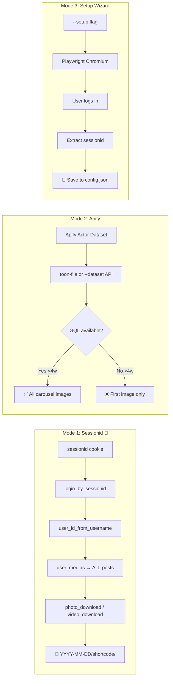
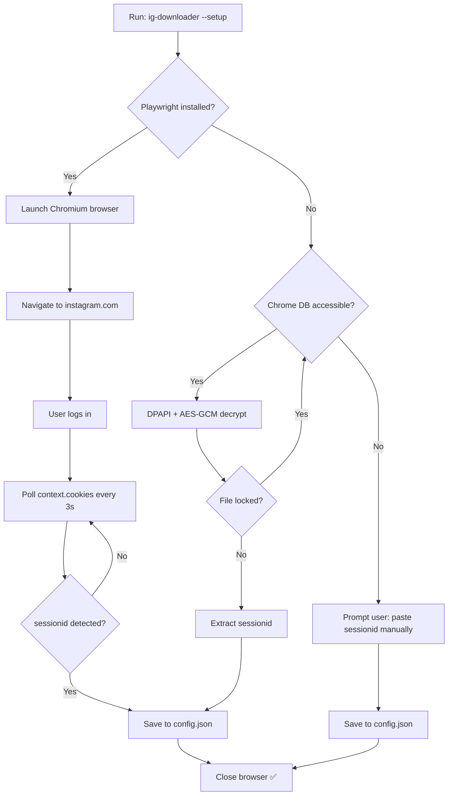

# Instagram Downloader Skill v2.2

> **Purpose**: Download all media (reels MP4, carousels with ALL images, photos JPG) from an Instagram profile. Three operation modes: sessionid (cookie, recommended), Apify (no login, limited), setup wizard (Playwright browser).

> **⚠ 2026-07-07: `--login` mode is BROKEN.** Meta deprecated the instagrapi login endpoint server-side. The `--login`, `--password`, and `--totp` flags exist but return 404. Use `--setup` (Playwright) or a manual `--sessionid` cookie instead.

---

## Operation Modes



### Mode Comparison

| Aspect | Sessionid 🥇 | Apify (legacy) | Setup Wizard |
|--------|-------------|----------------|--------------|
| **Authentication** | Cookie `sessionid` | None | Playwright browser |
| **All posts (any date)** | ✅ Yes | ✅ Yes | N/A (setup only) |
| **Carousels: ALL images** | ✅ Yes | ❌ 1st image only (old posts) | N/A |
| **Carousels: recent only** | ✅ Yes | ✅ GQL enhancement | N/A |
| **Private profiles** | ✅ (if you follow) | ❌ | N/A |
| **No watermark reels** | ✅ Yes | ✅ Yes (Apify) | N/A |
| **Session persistence** | ✅ config.json | N/A | ✅ config.json |
| **Setup time** | 1 min (first time) | 5 min (Apify account) | 30s (one-time) |
| **Cost** | $0 | ~$0.03/run | $0 |

---

## Architecture

### Credential Resolution Priority

The script auto-detects credentials in this order:

1. **`--sessionid` CLI flag** — one-shot session cookie (highest priority)
2. **`SESSIONID` environment variable** — for CI/automation  
3. **Config file** (`~/.ig-downloader/config.json`) — persistent, set by `--setup`
4. **Chrome cookies** — automatic extraction from browser SQLite (if logged in)

When no sessionid is found → falls to **`--setup`** (interactive) or **Apify mode**
(if dataset provided).

> ⚠ The `--login` mode (and its `settings.json` persistence) is **BROKEN**.
> Meta deprecated the login endpoint. All auth must use sessionid or --setup.

### Mode 1: Sessionid (Recommended)

```mermaid
flowchart LR
    COOKIE[sessionid cookie] --> LOGIN[login_by_sessionid]
    LOGIN --> UID[user_id_from_username]
    UID --> MEDIAS[user_medias<br/>amount=0 → ALL posts]
    MEDIAS --> TYPE{media_type}
    TYPE -->|1: Photo| PHOTO[photo_download → .jpg]
    TYPE -->|2: Video| REEL[video_download → .mp4]
    TYPE -->|8: Carousel| CAR[media_info → resources[]]
    CAR --> IMG1[_01.jpg]
    CAR --> IMG2[_02.jpg]
    CAR --> IMGN[_0N.jpg]
    PHOTO --> DIR[📁 YYYY-MM-DD/shortcode/]
    REEL --> DIR
    IMG1 --> DIR
    DIR --> INFO[+ post_info.txt]
```

### Mode 2: Apify (Fallback)

Same as v1.x: Apify Actor → dataset → toon file → download (with GQL carousel enhancement for recent posts).

### Interactive Setup



---

## Prerequisites

- **Python 3.7+**
- **`instagrapi >= 2.0.0`**: `pip install instagrapi`
- **`requests`**: `pip install requests`
- **Chrome** (optional, for interactive setup and cookie extraction)
- **Apify account** (free tier, only needed for Apify legacy mode)

---

## Getting the Sessionid Cookie

### Method A: Manual (1 minute)

1. Open Chrome, go to `https://www.instagram.com`
2. Log in to Instagram
3. Press **F12** → **Application** → **Cookies** → `www.instagram.com`
4. Find `sessionid` — copy its value
5. Run: `python instagram_downloader.py -u username --sessionid "YOUR_SESSIONID"`

### Method B: Interactive Setup (recommended)

```bash
python instagram_downloader.py --setup
```

This opens Instagram in your browser. Log in, and the script automatically detects the `sessionid` cookie, saves it to `~/.ig-downloader/config.json`, and exits. After that, no `--sessionid` flag needed.

### Method C: Environment Variable

```bash
set SESSIONID=YOUR_SESSIONID
python instagram_downloader.py -u username
```

---

## Workflow

### Sessionid Mode (Recommended, Full Access)

```bash
# One-time setup (Playwright browser → logs in → saves cookie)
python instagram_downloader.py --setup

# Then just download — sessionid auto-loaded from config
python instagram_downloader.py -u username -o ./downloads

# Or pass cookie directly (one-shot, no config needed)
python instagram_downloader.py -u username --sessionid "1234..." -o ./downloads
```

### Apify Mode (No Login)

```python
# Via MCP
await mcp_call-actor({ actor: "unseenuser/IG-posts", input: { usernames: ["username"] } })
await mcp_get-dataset-items({ datasetId: "<ID>", limit: 999, clean: true })

# Then download
python instagram_downloader.py --toon-file ./data.txt \
    -u username \
    --date-start YYYY-MM-DD --date-end YYYY-MM-DD \
    -o ./instagram_downloads
```

---

## Script Reference

**Location**: `instagram_downloader.py` (same directory)

### Command-Line Options

#### Mode Selection (auto-detected in order: login → sessionid → Apify → setup)

| Option | Description |
|--------|-------------|
| `--sessionid STR` | Instagram sessionid cookie (one-shot, overrides config/env). **Recommended auth method.** |
| `--setup` | Interactive setup: Playwright → Chrome → manual paste. Saves to config. |
| ~~`--login`~~ | ⚠ **BROKEN** — Meta deprecated the endpoint. Do NOT use. |
| ~~`--password STR`~~ | ⚠ **BROKEN** — part of `--login` mode. |
| ~~`--totp CODE`~~ | ⚠ **BROKEN** — part of `--login` mode. |
| `--setup` | Interactive setup: opens browser, polls for login, saves sessionid to config. |
| `--dataset ID` | Apify dataset ID (legacy, no login). |
| `--api-token KEY` | Apify API token (required with `--dataset`). |
| `--toon-file PATH` | Apify dataset exported as JSON/YAML. |

#### Files & Target

| Option | Description |
|--------|-------------|
| `-u / --username HANDLE` | Target Instagram handle (required for login/sessionid/setup). |
| `-o / --output DIR` | Output directory (default: `./instagram_downloads`). |
| `--flat` | Flatten: single folder instead of `YYYY-MM-DD/shortcode/`. |

#### Filters (Apify mode only; login/sessionid modes download ALL posts)

| Option | Description |
|--------|-------------|
| `--date-start YYYY-MM-DD` | Earliest post date (inclusive). |
| `--date-end YYYY-MM-DD` | Latest post date (inclusive). |
| `--type {reel,carousel,photo,all}` | Filter by post type (default: all). |
| `--own-only` | Only posts authored by `--username`. |
| `--mentions-only` | Only posts from other accounts mentioning `--username`. |

#### Misc

| Option | Description |
|--------|-------------|
| `--no-verify` | Skip SSL verification (not recommended). |
| `--version` | Show version and exit. |
| `--help` | Show help message. |

### Default Output Structure

```
instagram_downloads/
└── YYYY-MM-DD/
    ├── <SHORTCODE>/               # Reel
    │   ├── <SHORTCODE>.mp4
    │   ├── <SHORTCODE>.jpg        # Thumbnail
    │   └── post_info.txt
    ├── <SHORTCODE>/               # Photo
    │   ├── <SHORTCODE>.jpg
    │   └── post_info.txt
    └── <SHORTCODE>/               # Carousel
        ├── <SHORTCODE>.jpg        # First image (cl.photo_download)
        ├── <SHORTCODE>_02.jpg     # Image 2/N (from media_info)
        ├── <SHORTCODE>_03.jpg     # Image 3/N
        ├── ...
        └── post_info.txt
```

---

## Sessionid Under the Hood

### Cookie Extraction

The `--setup` flow:
1. Opens `https://www.instagram.com` in the default browser via `webbrowser.open()`
2. Polls the Chrome cookie SQLite database every 3 seconds
3. Reads cookies using `sqlite3` + DPAPI key decryption (AES-GCM with no-authentication-tag)
4. Once `sessionid` is detected, saves to `~/.ig-downloader/config.json`
5. Closes automatically

### Media Fetching

- `user_id_from_username()` → numeric user ID
- `user_medias(user_id, amount=0)` → ALL media items (amount=0 means unlimited)
- Each `Media` object has: `pk`, `code` (shortcode), `media_type` (1=photo, 2=video, 8=carousel), `taken_at` (datetime)
- Carousels: `media_info(pk)` returns `carousel_media[]` with all resources
- Downloads via `photo_download()` / `video_download()` with proper auth

### Config Storage

```json
{
  "sessionid": "YOUR_SESSIONID_COOKIE",
  "created_at": "2026-07-07T22:00:00"
}
```

Location: `~/.ig-downloader/config.json`

---

## Examples

### Sessionid mode (from config, simplest)

```bash
# After running --setup once
python instagram_downloader.py -u username -o ./downloads
```

### Sessionid mode (direct flag)

```bash
python instagram_downloader.py \
    -u username \
    --sessionid "1234567890%3Aabcdef" \
    -o ./downloads
```

### Sessionid mode (environment variable)

```bash
set SESSIONID=1234567890%3Aabcdef
python instagram_downloader.py -u username -o ./downloads
```

### Setup wizard (first time only)

```bash
python instagram_downloader.py --setup
```

### Apify mode (toon file, with filters)

```bash
python instagram_downloader.py \
    --toon-file ./data.txt \
    -u username \
    --type reel \
    --date-start YYYY-MM-DD \
    --date-end YYYY-MM-DD \
    -o ./reels_only
```

### Apify mode (API token)

```bash
python instagram_downloader.py \
    --dataset <DATASET_ID> \
    --api-token apify_api_xxx \
    -u username \
    -o ./downloads
```

---

## Troubleshooting

| Problem | Solution |
|---------|----------|
| "No instagrapi" | `pip install instagrapi` |
| Login fails | Check username/password. For 2FA, provide `--totp CODE`. For challenge, check terminal for SMS/email prompt. |
| "Login required" in sessionid mode | sessionid expired. Re-run `--setup` to get a fresh one. |
| "No sessionid found" | Run `--setup` or pass `--sessionid` directly. |
| Chrome cookie extraction fails | Use `--sessionid` flag with manual cookie from DevTools. |
| 403 on fbcdn.net | Use login/sessionid mode (instagrapi handles auth). |
| Apify returns 403 | CDN URL expired → re-run the Actor. |
| GQL timeout | Old post > 4 weeks → falls back to Apify thumbnail. |
| No items in sessionid mode | Check username; profile may be private and sessionid may not follow it. |
| ModuleNotFoundError: No module named 'win32crypt' | Auto-detected; falls back to manual `--sessionid` flag. |
| "No items parsed" in toon mode | Toon format may differ → try `--dataset` API mode. |

---

## Known Issues

### 1. Sessionid Expiration
Instagram session cookies expire after some time (days-weeks). When this happens, re-run `--setup` or pass a fresh `--sessionid`. Login mode avoids this via saved sessions + auto-reload.

### 2. Login Challenge Detection
Instagram may trigger a challenge (SMS/email code) on first login from a new IP. The script detects this and prompts you interactively. After the first successful login, the saved session prevents future challenges.

### 3. Chrome DPAPI Decryption
Cookie extraction uses Windows DPAPI + AES-GCM. Works with Chrome's latest cookie encryption (no-authentication-tag variant). If Chrome updates its format, extraction may break.

### 4. Private Profiles
Login/sessionid modes can only download profiles that the logged-in user follows. For private profiles you don't follow, Apify mode with `unseenuser/IG-posts` may work (the actor runs its own session).

### 5. Carousel GQL Limit (Apify mode)
GQL enhancement works only for recent posts (< 4 weeks). Older posts get single thumbnail. Login/sessionid modes avoid this entirely.

### 6. CDN URL Expiry (Apify mode)
Apify URLs expire after hours. Download soon after fetching. Login/sessionid modes avoid this entirely.

---

## Changelog

| Version | Date | Changes |
|---------|------|---------|
| 2.1.0 | 2026-07 | Login mode: `--login` with password prompt, 2FA (`--totp`), challenge handler, saved session persistence via `dump_settings()` |
| 2.0.0 | 2026-07 | Sessionid mode with instagrapi full access; interactive setup wizard; Chrome cookie extraction; config management; 3-mode architecture |
| 1.1.0 | 2026-07 | instagrapi GQL hybrid for carousel enhancement; `--no-instagrapi` flag |
| 1.0.0 | 2026-07 | Initial Apify-based release |

---

**Instagram Downloader Skill v2.2.0** — Sessionid + Apify + Playwright setup. Zero compromises.
